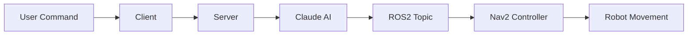

# enpm605_ros_spring2025
ROS packages for ENPM605 (Spring 2025)

# Lecture 14

## ros2-system-monitor

## rosgpt

## ROSAnthropic Nav2

A ROS2 package that enables natural language robot navigation using Anthropic's Claude AI and the Navigation2 stack.

### Overview

ROSAnthropic Nav2 creates a bridge between natural language commands and robotic navigation. Users can control a ROS2-enabled robot using simple spoken or typed commands such as "Go to top_right_corner" or "Follow a path through the top left corner, top right corner, and bottom h."

The system leverages Anthropic's Claude AI to parse natural language commands and convert them into structured navigation instructions that the Navigation2 stack can execute.

### Features

- Natural language command interpretation
- Multiple navigation modes:
  - Direct navigation to a single destination
  - Sequential waypoint navigation (with stops at each point)
  - Continuous path following (without stopping)
- Web interface for command input
- Text-to-speech feedback (optional)
- Robust error handling and graceful degradation


### Components

The system consists of three main Python scripts:

1. **ros_anthropic_nav2_server.py**: Provides a web server interface and connects to Claude AI
2. **ros_anthropic_nav2_control.py**: Controls robot navigation using the Nav2 stack
3. **ros_anthropic_nav2_client.py**: Command-line interface for sending navigation commands


#### Command Input (Client)
- User enters natural language commands
- Client sends commands to server via HTTP POST
- Example commands:
  - "Go to top right corner"
  - "Navigate through top right corner, bottom right corner, and bottom left corner"

#### Language Processing (Server)

- Server receives text command
- Command sent to Claude AI via Anthropic API
- Claude converts natural language to structured JSON format
- Supported action types:
  - `go_to_goal`: Single location navigation
  - `follow_path`: Continuous path through multiple points
  - `sequence`: Series of waypoints with optional stopping

#### Command Publishing

- Server publishes JSON command to `/voice_cmd` ROS2 topic
- Optional text-to-speech provides verbal feedback

#### Navigation Execution (Controller)

- Controller subscribes to `/voice_cmd` topic
- Parses JSON command to extract navigation parameters
- Maps location names to physical coordinates
- Uses Nav2's BasicNavigator for navigation execution

####  Movement Strategies

- Direct Navigation: Go to a single destination
- Waypoint Following: Visit multiple locations with stops
- Continuous Path: Follow a path without stopping at intermediary points

#### Example Command Flow

For the command: `"Go to top right corner, then to bottom left"`

1. **User Entry**: Types command in client interface
2. **Client Processing**: Sends HTTP request to server
3. **Server Processing**: Forwards to Claude AI
4. **AI Understanding**: Claude generates structured JSON:
```json
{
  "action": "sequence", 
  "params": [
    {"action": "go_to_goal", "params": {"location": {"type": "str", "value": "top_right_corner"}}},
    {"action": "go_to_goal", "params": {"location": {"type": "str", "value": "bottom_left_corner"}}}
  ],
  "continuous_path": false
}
```
5. **Command Publishing**: JSON published to ROS2 topic
6. **Navigation Planning**: Controller extracts waypoints
7. **Execution**: Nav2 navigates to kitchen, stops, then continues to bedroom
8. **Completion**: Controller logs successful navigation
9. 
### Available Locations

The system is configured with the following locations:
- top_right_corner
- top_left_corner
- bottom_left_corner
- bottom_right_corner
- top_h
- bottom_h

### Installation

Install required dependencies:

#### Python Dependencies

```bash
pip install anthropic flask flask-restful flask-cors rclpy requests pyttsx3 transforms3d
```

#### ROS2 Dependencies

- Pull packages from the repository.
```bash
# Install missing dependencies
rosdep install --from-paths src -y --ignore-src

```

#### Run Demonstration
```bash
# Build the packages
colcon build --symlink-install --packages-select mapping_navigation_demo rosgpt

# Start the simulation environment
ros2 launch mapping_navigation_demo navigation_with_map_corrected.launch.py

# Start the controller
ros2 run rosgpt anthropic_nav2_control

# Start the server
ros2 run rosgpt anthropic_nav2_server

# Start the client
ros2 run rosgpt anthropic_nav2_client

```